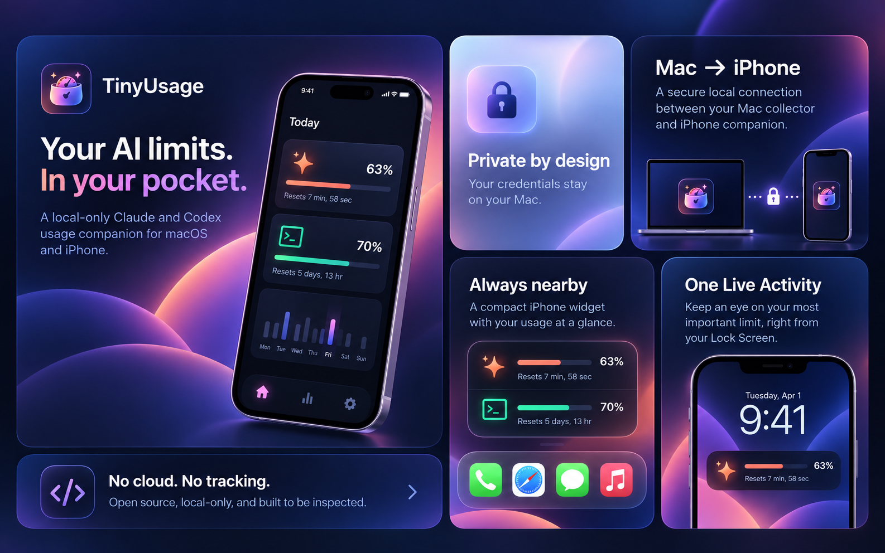
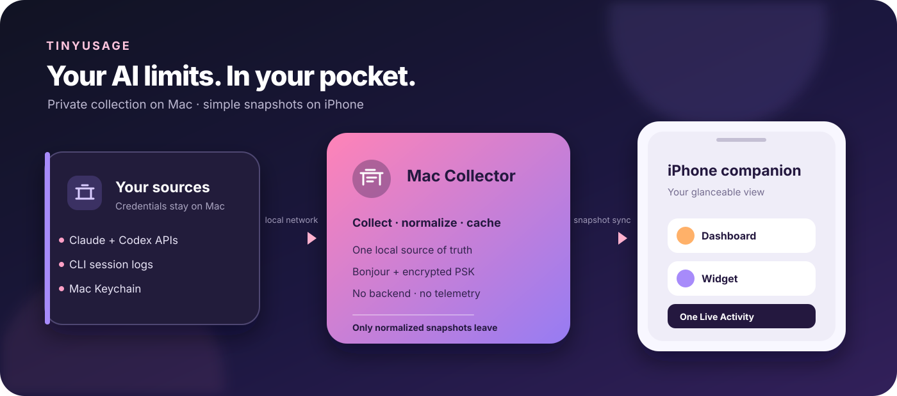

# TinyUsage

### Your AI limits. In your pocket. 

TinyUsage is a local-only macOS collector and iPhone companion for Claude and Codex usage. It turns quotas, official API usage, and local estimates into one calm dashboard—with widgets and a single configurable Live Activity.

> No cloud. No telemetry. No mystery sync. Your Mac collects; your iPhone displays.



## Why TinyUsage?

- **One glance:** subscription limits, official organization usage, and local estimates stay visibly separate.
- **Local by design:** provider credentials never leave the Mac; iOS receives normalized snapshots only.
- **Useful offline:** the last known snapshot remains available when the Mac or Wi‑Fi is away.
- **Open source:** inspect every connector, migration, and wire message before you run it.

TinyUsage is source-only. There are no signed binaries, App Store builds, Homebrew formulae, backend accounts, CloudKit containers, proprietary push service, or analytics SDK.

<details>
<summary>See the technical architecture</summary>



</details>

## Quick start

Requirements: macOS 15+, iOS 18+, Xcode 16+, Swift 6, and [XcodeGen](https://github.com/yonaskolb/XcodeGen).

```sh
brew install xcodegen
make bootstrap
make test
make build
```

The default build is unsigned and works with an iOS Simulator. To run on your own devices, create local signing settings (never commit them):

```sh
./scripts/configure-signing.sh YOUR_TEAM_ID com.example.tinyusage
make generate
```

The script writes ignored `Config/Developer.xcconfig`. The bundle prefix and App Group are derived from that prefix, so every contributor can use their own Team ID without changing tracked files. See [CONTRIBUTING.md](CONTRIBUTING.md) for the full workflow.

## Connect Mac and iPhone

1. Launch **TinyUsage Collector** on the Mac and choose **Pair an iPhone**.
2. On iPhone, choose **Pair with Mac**, allow Local Network and Camera, then scan the QR code.
3. Confirm the named iPhone on the Mac.
4. Pull to refresh once the approval completes.

The two-minute QR offer contains a random 256-bit secret and is invalidated after use, rejection, or expiry. Bonjour advertises only a protocol version, display name, and ephemeral service ID. The connection uses TLS with a pre-shared key; established keys live in each device's Keychain.

If discovery fails, confirm both devices are on the same reachable Wi‑Fi, Local Network access is enabled, and VPN/client-isolation rules are not blocking Bonjour. Cached data remains visible while the Mac is offline.

## What is collected?

Claude and Codex each have independent cards:

| Section | Source | Trust label |
| --- | --- | --- |
| Subscription quota | Provider subscription endpoint (opt-in) | Experimental |
| API usage and cost | Official organization API | Official |
| Local activity | Claude Code/Codex logs | Estimated |

Values are never added across sections. A failed source keeps its last good result and reports the error beside it. Unknown values stay unknown—not zero. Private endpoints are optional and can be disabled independently.

## Widgets and Live Activity

The widget reads only the versioned App Group snapshot. It performs no Bonjour or provider request. Choose the provider and metric shown by the widget or the single Live Activity (for example, Claude session or weekly quota). The countdown is local and only describes the known reset time; it is not a real-time network connection.

## Project map

- `TinyUsageDomain` — shared models, persistence, framing, and configuration boundary.
- `TinyUsageCollectorCore` — connectors, credential resolution, log scanners, and aggregation.
- `TinyUsageCollector` — menu-bar app, Keychain, cache, Bonjour server, and pairing approval.
- `TinyUsage` — iOS onboarding, sync, dashboard, widget preferences, and Live Activity controls.
- `TinyUsageWidget` — read-only snapshot rendering.
- `project.yml` — XcodeGen source of truth.

Read the design in [docs/ARCHITECTURE.md](docs/ARCHITECTURE.md), the data promise in [docs/PRIVACY.md](docs/PRIVACY.md), and the public launch page in [`docs/index.html`](docs/index.html).

## Verification

```sh
make format-check       # Swift formatting
make generate-check     # no XcodeGen drift
make test               # SwiftPM, macOS, and iOS tests
make build              # unsigned macOS + iOS Simulator builds
```

CI repeats these checks, runs CodeQL, and scans the complete history for secrets. A real Mac+iPhone acceptance pass is still needed for Local Network permission, sleep/wake, network changes, pairing revocation, and background scheduling (which iOS may defer).

## Contributing and safety

Please read [CONTRIBUTING.md](CONTRIBUTING.md), [SECURITY.md](SECURITY.md), and [CODE_OF_CONDUCT.md](CODE_OF_CONDUCT.md) before opening a change. Never attach credentials, raw provider responses, cookies, user paths, or diagnostic exports to an issue. TinyUsage is MIT-licensed; see [LICENSE](LICENSE) and [THIRD_PARTY_NOTICES.md](THIRD_PARTY_NOTICES.md).

Maintained by **NUGGETS CONSULTING FZCO**. Claude, Codex, Anthropic, and OpenAI are trademarks of their respective owners; TinyUsage is an independent companion.
